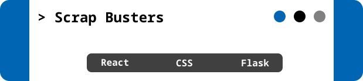
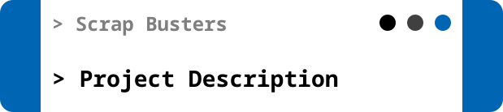
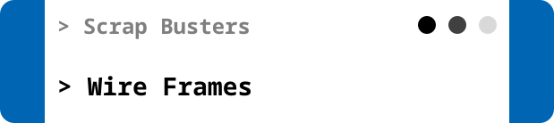
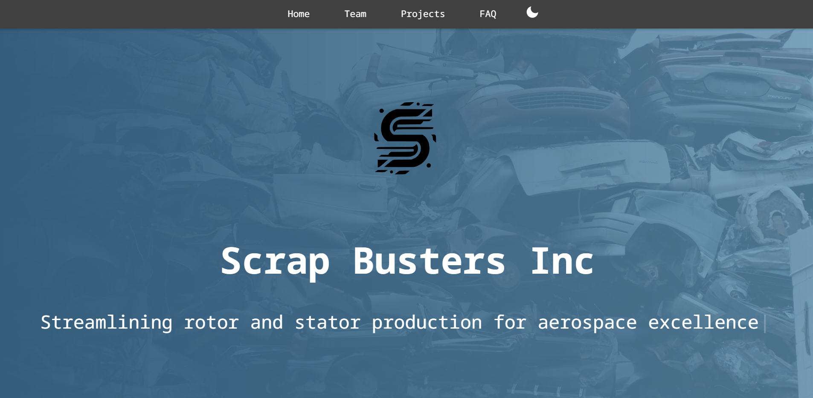
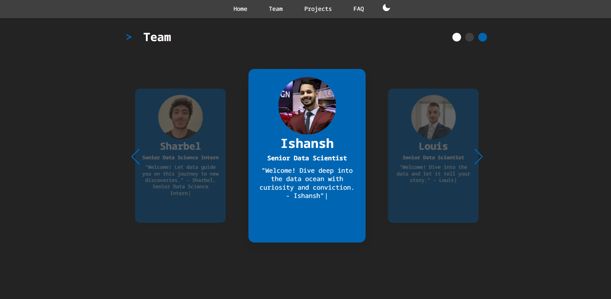
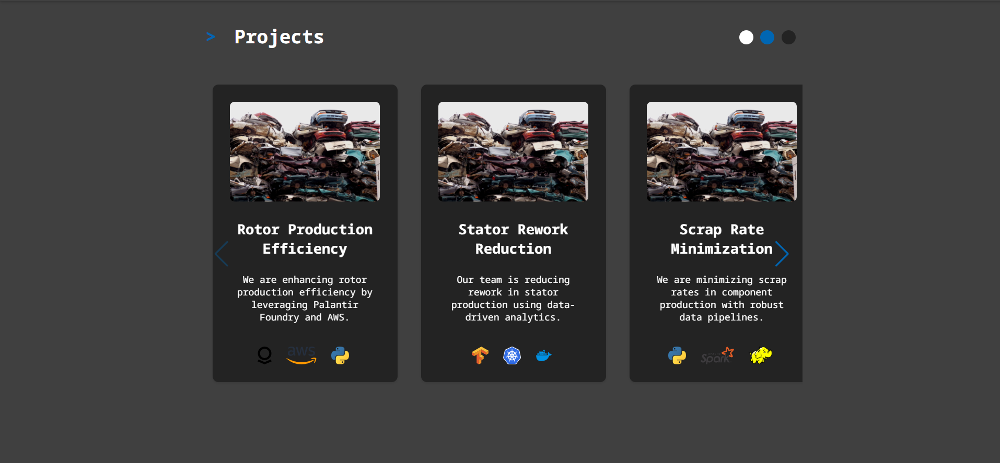
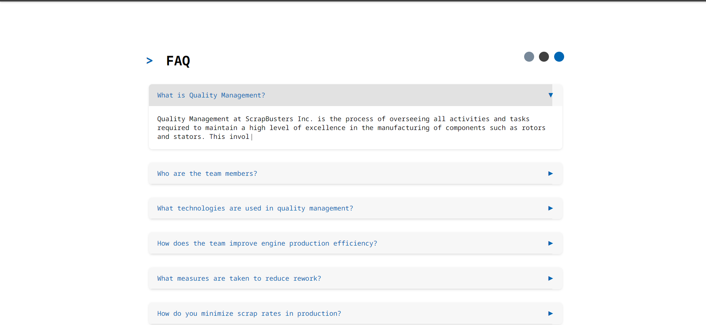
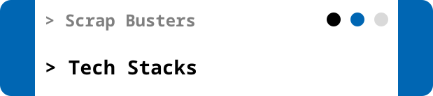

# ScrapBusters Inc. Quality Management Team Introduction Website :gear:

> ScrapBusters Inc., a leader in digitalizing quality management, focuses on enhancing engine production efficiency, reducing rework, and minimizing scrap rates in the production of rotors, stators, and other components. This project aims to introduce the innovative and dedicated Quality Management Team to the world through a dynamic and informative website.


<p align="center">
  
</p>



<div align="center">

Hello world! As part of our software engineering internship at ScrapBusters Inc., I have developed this website to showcase our Quality Management Team's efforts and achievements.

**[PROJECT DESCRIPTION](#project-description) • [WIREFRAMES](#wireframe) • [TECH STACK](#tech-stack)  • [HOW TO RUN?](#how-to-run?)**

</div>

<br><br>
<p align="center">
    
</p>


### Purpose of the Project :dart:
> The purpose of this project is to create a user-friendly website that effectively introduces the Quality Management Team at ScrapBusters Inc. The website features detailed profiles of team members, an overview of our projects, and integrates the GPT API to provide interactive and personalized content for visitors.

### User Stories

- As a visitor, I want to easily navigate the website to learn about the team and their projects.
- As a visitor, I want to interact with dynamic content that responds to my inquiries instantly.
- As a team member, I want to showcase my projects and achievements in a professional manner.
- As an admin, I want to update team information and manage content easily.

<br><br>
<p align="center">
    
</p>

> These wireframes were initially sketched on paper, followed by digital refinement in Figma to ensure every detail was captured.

### **Website Layout**

| Home Page                              | Team Page                              | Project Page         | FAQ Page         |
| -------------------------------- | --------------------------------- | ------------------------ | ------------------------ |
|  | | | |

<br><br>


<p align="left">
Languages <br>

<p align="left">
<a target="_blank" rel="noreferrer">  </a> <a target="_blank" rel="noreferrer">  </a> <a target="_blank" rel="noreferrer">  </a> <a target="_blank" rel="noreferrer">  </a> 
</p>

<p align="left">
Frameworks<br>
<a target="_blank" rel="noreferrer">  </a>
<a target="_blank" rel="noreferrer">  </a>
</p>

### Setup Instructions

1. **Clone the Repository**:
    ```bash
    git clone https://github.com/Ghantoos7/ScrapBusters.git
    ```

2. **Navigate to Project Directory**:
    ```bash
    cd ScrapBusters
    ```

3. **Install Backend Dependencies**:
    ```bash
    cd server

    pip install -r requirements.txt
    ```

4. **GPT API Key**
    
    Create an .env file (in server directory) and inside put your API key

    ```bash
    OPENAI_API_KEY='your_key_here'
    ```
 

5. **Install Frontend Dependencies**:
    ```bash
    cd client

    npm install
    ```
6. **Set The URL of the backend API server**
    Create another .env file (in client directory) and inside put

    ```bash
    REACT_APP_API_URL=http://localhost:5000
    ```
<br>


